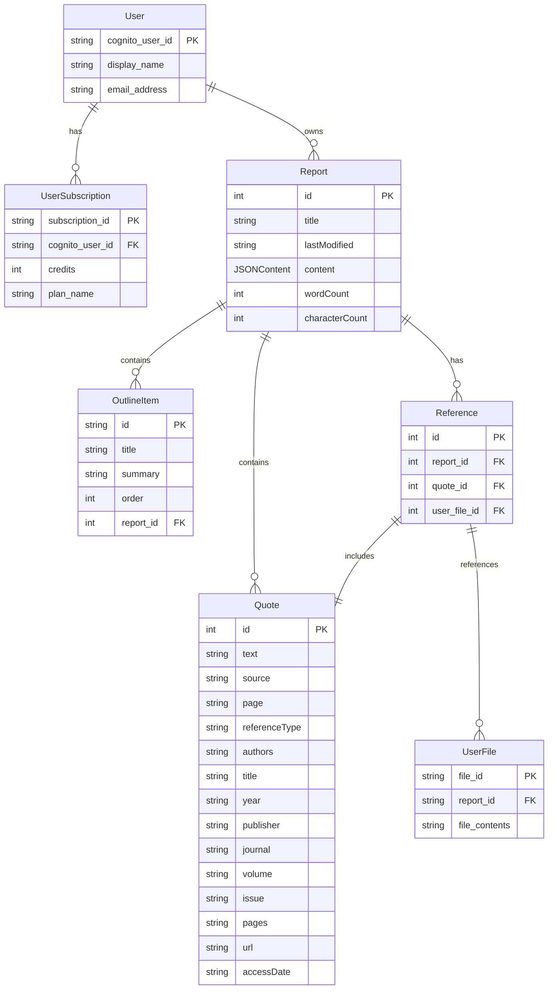

# AI 搭載レポートエディタ

このプロジェクトは、Next.js、TypeScript、および Novel（Tiptap/ProseMirror）を使用して構築された、AI を活用したレポート作成・編集ツールです。プロジェクト管理機能と高度な AI アシスタント機能を備えています。

## 機能概要

- **プロジェクト管理**: プロジェクトの作成、一覧表示、検索機能
- **AI レポートエディタ**: リッチテキスト編集、スラッシュコマンド、選択メニュー
- **参考文献管理**: 引用の追加、フォーマット、参考文献リスト
- **AI チャットアシスタント**: レポート作成中に AI アシスタントとチャット

## システム構成

このアプリケーションは以下の主要コンポーネントで構成されています：

1. **フロントエンド**: Next.js App Router を使用したクライアントサイドアプリケーション
2. **バックエンド**: Next.js API Routes を使用したサーバーサイド機能
3. **AI 統合**: 外部 AI API との連携による高度な文章生成・編集機能
4. **データ管理**: ユーザー、レポート、参考文献のデータ管理

## データフロー

### ユーザーインターフェースとデータの流れ

1. **ユーザー認証フロー**:

   - ユーザーはログイン画面でメールアドレスとパスワードを入力
   - 認証情報は `/api/user/login` エンドポイントに送信され、検証される
   - 認証成功後、ユーザー情報とサブスクリプション情報がフロントエンドに返される
   - ユーザーはホームページ（ダッシュボード）にリダイレクトされる

2. **レポート作成フロー**:

   - ユーザーは新規レポート作成ページで概要、文字数、トーン、参考文献を入力
   - この情報は `/api/ai/outline` エンドポイントに送信され、AI がレポートの目次を生成
   - 生成された目次は `/api/ai/report` エンドポイントに送信され、AI がレポート本文を生成
   - 生成されたレポートはエディタページに表示され、ユーザーが編集可能になる

3. **レポート編集フロー**:

   - ユーザーはエディタでレポートを編集
   - テキスト選択時に表示される選択メニューから AI 機能（書き換え、改善など）を利用可能
   - AI 機能は `/api/ai/editor` エンドポイントを通じて処理される
   - エディタの変更は自動的に保存され、`/api/report` エンドポイントを通じてサーバーに送信される

4. **参考文献管理フロー**:

   - ユーザーはファイルをアップロードして参考文献を追加（`/api/report/user-files` エンドポイント）
   - または AI 検索機能を使用して参考文献を検索（`/api/ai/reference_search` エンドポイント）
   - 参考文献はレポートに関連付けられ、引用として挿入可能
   - 引用形式（APA、MLA、Chicago、Harvard）に基づいて自動的にフォーマットされる

5. **AI チャットアシスタントフロー**:

   - ユーザーはチャットパネルで AI アシスタントと対話
   - メッセージは `/api/ai/chat` エンドポイントを通じて処理される
   - AI モード（スピーディ、ターボ）とチャットモード（一般的な会話、参考文献について質問）を選択可能

6. **エクスポートフロー**:
   - ユーザーはレポートを PDF、DOCX、TXT、HTML 形式でエクスポート可能
   - エクスポート処理は `/api/export` エンドポイントを通じて行われる
   - エクスポートされたファイルはユーザーのデバイスにダウンロードされる

## データモデル

以下は主要なデータモデルとその関係です：

### ユーザー関連

- **User**: ユーザー情報（ID、表示名、メールアドレス）
- **UserSubscription**: サブスクリプション情報（ID、ユーザー ID、クレジット数）

### レポート関連

- **Report**: レポート基本情報（ID、タイトル、最終更新日時）
- **ReportData**: レポート詳細情報（コンテンツ、単語数、文字数、参考文献、引用）
- **OutlineItem**: レポートの目次項目（ID、タイトル、概要、順序）

### 参考文献関連

- **Reference**: 参考文献情報（ID、引用、ユーザーファイル）
- **Quote**: 引用情報（ID、テキスト、ソース、ページ、著者、タイトル、年、出版社など）
- **UserFile**: ユーザーがアップロードしたファイル情報（ファイル ID、レポート ID）

### AI 関連

- **EditorAiTask**: エディタで利用可能な AI タスク（ID、ラベル、説明、タイプ）
- **ChatMessage**: チャットメッセージ（ID、テキスト、送信者、タイムスタンプ）
- **AiMode**: AI モード設定（ID、名前、説明）
- **ChatMode**: チャットモード設定（ID、名前、説明）

## ER 図

以下は、システムのデータモデルを表す ER 図の提案です：



## ディレクトリ構造

```
.
├── docs/                  # プロジェクトドキュメント
├── public/                # 静的アセット
├── src/                   # ソースコード
│   ├── app/               # Next.js アプリケーションルーター
│   │   ├── api/           # API エンドポイント
│   │   │   ├── ai/        # AI 関連 API
│   │   │   ├── export/    # エクスポート API
│   │   │   ├── report/    # レポート管理 API
│   │   │   └── user/      # ユーザー管理 API
│   │   ├── home/          # ホームページ（プロジェクトダッシュボード）
│   │   ├── login/         # ログインページ
│   │   ├── new-report/    # 新規レポート作成ページ
│   │   └── report/        # レポート編集ページ
│   ├── components/        # 共通コンポーネント
│   ├── constants/         # 定数とモックデータ
│   ├── contexts/          # Reactコンテキスト
│   ├── lib/               # ユーティリティ関数
│   └── types/             # TypeScript型定義
└── ...                    # 設定ファイル
```

## 技術スタック

- **フレームワーク**: [Next.js](https://nextjs.org/)（App Router を使用）
- **言語**: [TypeScript](https://www.typescriptlang.org/)
- **エディタ**: [Novel](https://novel.sh/)（[Tiptap](https://tiptap.dev/)/[ProseMirror](https://prosemirror.net/)ベース）
- **UI ライブラリ**: [Tailwind CSS](https://tailwindcss.com/)、[shadcn/ui](https://ui.shadcn.com/)
- **状態管理**: React Hooks、Contexts
- **アニメーション**: [Framer Motion](https://www.framer.com/motion/)

## 始め方

まず、開発サーバーを起動します:

```bash
npm run dev
```

ブラウザで [http://localhost:3000](http://localhost:3000) を開くと、アプリケーションが表示されます。

## 詳細ドキュメント

各ディレクトリには、より詳細な情報を含む README ファイルがあります:

- [src/app/README.md](src/app/README.md) - アプリケーションページの詳細
- [src/app/api/README.md](src/app/api/README.md) - API エンドポイントの詳細
- [src/components/README.md](src/components/README.md) - 共通コンポーネントの詳細
- [src/contexts/README.md](src/contexts/README.md) - コンテキストの詳細
- [src/lib/README.md](src/lib/README.md) - ユーティリティ関数の詳細
- [src/types/README.md](src/types/README.md) - 型定義の詳細
- [docs/README.md](docs/README.md) - プロジェクトドキュメントの詳細

## アーキテクチャ

アプリケーションのアーキテクチャについては、[docs/architecture.txt](docs/architecture.txt)を参照してください。
